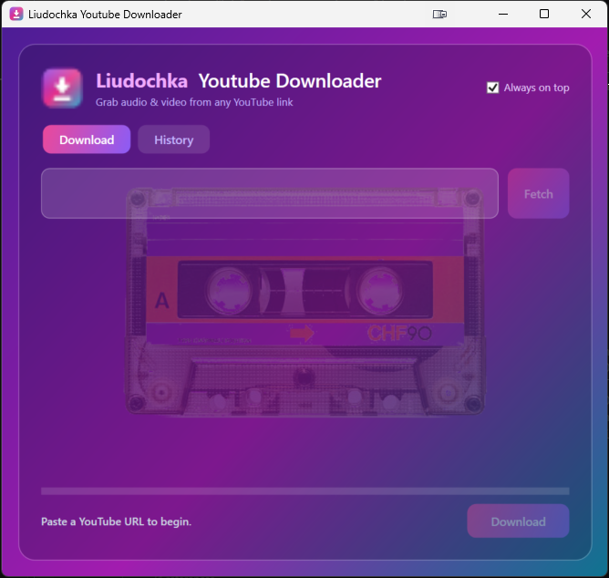

# 🎀 Liudochka Youtube Downloader

A small, friendly Windows desktop app for grabbing **audio and video from any YouTube link** — pick a format, pick a quality, and download. Built with WPF on .NET 8, with a frosted-glass cassette theme.


<!-- Add a screenshot: save a PNG to docs/screenshot.png, then uncomment the line below -->
<!--  -->

## Features

- **Download audio or video** — save as **MP3** (selectable bitrate) or **video** (selectable quality).
- **Fetch first** — paste a link and see the title and author before committing to a download.
- **Smart quality hints** — warns you when the requested quality would upscale beyond what the source offers.
- **Live progress** — a gradient progress bar tracks download + conversion.
- **History** — every download is remembered, **grouped by date** and **searchable** by title or link. From any entry you can:
  - **Use** — drop the link back into the download box
  - **Open** — open the video in your browser
  - **Folder** — reveal the saved file in Explorer
  - **Remove** a single entry, or **Clear all**
- **Remembers your last save folder** so you're not re-navigating every time.
- **Always-on-top toggle** (on by default, and your choice is persisted across restarts).
- **No manual FFmpeg setup** — the required FFmpeg binaries are downloaded automatically on first use.

## Requirements

- **Windows** (the app targets `net8.0-windows` and uses WPF)
- **[.NET 8 SDK](https://dotnet.microsoft.com/download/dotnet/8.0)** — only needed to build/run from source. A published release is self-contained and needs no .NET install.

## Getting started (from source)

```sh
git clone https://github.com/VitakSharper/YoutubeDownloader.git
cd YoutubeDownloader

# Run it
dotnet run --project YoutubeDownloader.App

# Run the tests
dotnet test
```

FFmpeg is fetched automatically into `%LocalAppData%\YoutubeDownloader\ffmpeg` the first time it's needed.

## Building a standalone release

A single self-contained `.exe` (no .NET runtime required on the target machine) can be produced with the included script:

```sh
publish.cmd
```

This runs a Release publish for `win-x64` (single file, compressed) and writes the result to:

```
dist\LiudochkaYoutubeDownloader.exe
```

## Where your data lives

Everything is stored under `%LocalAppData%\YoutubeDownloader`:

| Path | Contents |
|------|----------|
| `ffmpeg\` | Auto-downloaded FFmpeg binaries |
| `history.json` | Your download history |
| `settings.json` | App settings (always-on-top, last save folder) |

Deleting that folder resets the app to a clean state.

## Project structure

```
YoutubeDownloader.sln
├─ YoutubeDownloader.Core/        Platform-agnostic logic (net8.0)
│  ├─ Services/                   YouTube access, FFmpeg, history, settings, …
│  ├─ ViewModels/                 MVVM view models (CommunityToolkit.Mvvm)
│  ├─ Models/ · Helpers/ · Ffmpeg/
├─ YoutubeDownloader.App/         WPF UI (net8.0-windows) + DI wiring
├─ YoutubeDownloader.Core.Tests/  Unit tests
└─ publish.cmd                    Single-file release build
```

The UI is kept thin: all logic lives in `Core` behind interfaces and is wired up with `Microsoft.Extensions.DependencyInjection` in [`App.xaml.cs`](YoutubeDownloader.App/App.xaml.cs), which keeps the core testable.

## Built with

- [YoutubeExplode](https://github.com/Tyrrrz/YoutubeExplode) — YouTube metadata and stream access
- [Xabe.FFmpeg](https://github.com/tomaszzmuda/Xabe.FFmpeg) — media conversion + automatic FFmpeg download
- [CommunityToolkit.Mvvm](https://learn.microsoft.com/dotnet/communitytoolkit/mvvm/) — MVVM helpers
- WPF on .NET 8

## Disclaimer

This is a personal hobby project and is **not affiliated with YouTube or Google**. Please download only content you have the right to, and respect YouTube's Terms of Service and applicable copyright law.
